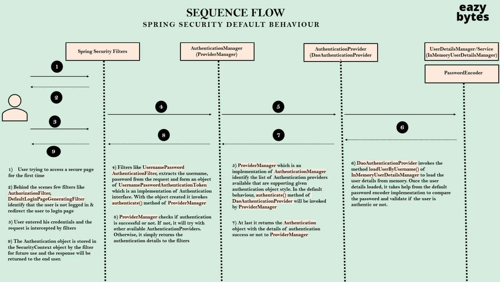

# PADAWAN TO MASTER SPRING-SECURITY

With out Lambda DSL

    http.authorizeHttpRequests()
        .requestMatchers("/info").permitAll()
        .requestMatchers("/myBalance).permitAll().and().formLogin().and().httpBasic();

With Lambda DSL

    http.authorizeHttpRequests((requests)-> .requestMatchers("/info").permitAll()
                                            .requestMatchers("/myBalance).permitAll())  .formLogin(Customizer.withDefaults())
                                                                                        .httpBasic(Customizers.withDefaults());

## DEFINING & MANAGING USERS

### InMemoryUserDetailsManager
Instead of defining a single user inside application.properties, as a next step we can define multiple users along with their authorities.

    @Bean
    public InMemoryUserDetailsManager userDetailsService(){
        UserDetails admin = User.withDefault.PasswordEncoder()
            .username("admin")
            .password("1234")
            .authorities("admin")
            .build();
    
        UserDetails user = User.withDefault.PasswordEncoder()
            .username("user")
            .password("1234")
            .authorities("user")
            .build();

        return new InMemoryUserDetailsManager(admin,user);
    }